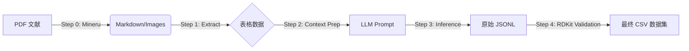

# ChemDataMiner

[](https://opensource.org/licenses/MIT)
[](https://www.python.org/)
[](https://www.rdkit.org/)

**ChemDataMiner** 是一个模块化的 AI for Science (AI4S) 数据挖掘流水线。它致力于从非结构化的化学文献（PDF）中自动化提取结构化的分子数据（SMILES）及其物理化学性质（如 HOMO/LUMO 能级、光伏参数等）。

本项目结合了基于深度学习的文档解析工具（Mineru/Magic-PDF）、大语言模型（LLM）的语义理解能力，以及 RDKit 的化学信息学验证，构建了一个高精度的闭环提取系统。

---

## 重要说明（当前代码状态）

- `src/step2_llm_prep.py` 目前是占位/示例实现（尚未生成 `data/processed/llm_process.jsonl`），需要你按真实项目逻辑补全。
- `main.py` 的模块名引用与 `src/` 下实际文件名目前不一致（例如 `step0_process_pdf` vs `step0_mineru`、`step3_llm_run` vs `step3_llm`），因此建议先按“逐步运行（推荐）”方式执行各 step；如果你希望我顺手把入口脚本修好，也可以继续提需求。

---

## 核心功能 (Key Features)

-   **智能文档解析 (Step 0)**: 集成 `Mineru`，支持将复杂的双栏排版 PDF 精准转换为 Markdown，保留表格结构。
-   **表格清洗与提取 (Step 1)**: 自动识别文献中的数据表，剔除噪音行，修复表头漂移问题。
-   **LLM 语义增强 (Step 2 & 3)**: 利用 LLM (DeepSeek/GPT) 结合上下文信息，解决化学缩写（如 "1a", "L1"）与具体分子结构的对应关系。
-   **化学专业验证 (Step 4)**: 
    -   基于 **RDKit** 的 SMILES 合法性校验。
    -   自动脱盐（Desalting）与标准化。
    -   物理量单位归一化（如 Hartree 转 eV）。
-   **容器化支持**: 提供轻量级 Docker 支持，解决 RDKit 系统级依赖问题。

---

## 处理流程 (Pipeline)



---

## 安装 (Install)

### Python 环境

- Python 3.10+
- 依赖见 `requirements.txt`

```bash
pip install -r requirements.txt
```

### Step 0 依赖：Mineru（可选）

Step 0 依赖系统里可用的 `mineru` 命令行工具（本仓库不包含其安装脚本）。如果你不跑 Step 0，也可以手动把 PDF 转成 `.md` 并放到 `data/01_raw/`。

---

## 目录结构与数据流

项目在运行时会自动创建这些目录（定义于 `src/config.py`）：

```
data/
  00_pdfs/          # Step 0 输入：原始 PDF
  01_raw/           # Step 0 输出 / Step 1 输入：Mineru 生成的每篇文献文件夹（含 .md）
  processed/        # Step 1-4 的中间产物与最终数据集
  temp_staging/     # Step 0 批处理时临时目录
```

Step 1-4 的默认输出文件（`src/config.py: FILES`）：

- `data/processed/tables_final.txt`：清洗后的表格块（文本）
- `data/processed/llm_process.jsonl`：LLM 输入（Step 2 生成）
- `data/processed/post_llm.jsonl`：LLM 输出（Step 3 生成）
- `data/processed/dataset.csv`：最终数据集（Step 4 生成）

---

## 运行方式（推荐：逐步运行）

从项目根目录执行（确保当前工作目录在仓库根目录）：

### Step 0：PDF -> Markdown（可选）

你可以直接用 Mineru 把 PDF 批量转到 `data/01_raw/`，例如：

```bash
mineru -p data/00_pdfs -o data/01_raw
```

然后继续 Step 1。

### Step 1：抽取并清洗表格

```bash
python -m src.step1_extract
```

说明：
- 会递归扫描 `data/01_raw/**.md`
- 目前用 BeautifulSoup 查找 HTML `<table>`；如果你的 `.md` 不是 HTML 表格而是 Markdown 表格，可能会提取不到（见 Troubleshooting）

### Step 2：准备 LLM 输入（需要你补全逻辑）

```bash
python -m src.step2_llm_prep
```

Step 3 期望的 `llm_process.jsonl` 每行大致形如（示例字段名来自 `src/step3_llm.py` 的读取逻辑）：

```json
{
  "source_file": "path/to/paper.md",
  "table_content": "grid table text ...",
  "extracted_context": "definition snippets ..."
}
```

### Step 3：调用 LLM 结构化抽取

1) 在 `.env` 中设置你的 key（当前代码读取 `API_KEY`）：

```bash
API_KEY=your_key_here
```

2) 编辑 `src/step3_llm.py`：
- `BASE_URL`：替换为你的 LLM API 地址（OpenAI-compatible）
- `model`：默认为 `deepseek-chat`，按需替换

3) 运行：

```bash
python -m src.step3_llm
```

### Step 4：RDKit 校验、脱盐、单位/数值清洗，输出 CSV

```bash
python -m src.step4_post_process
```

输出：`data/processed/dataset.csv`

---

## Docker（用于简化 RDKit 依赖）

构建镜像：

```bash
docker build -t chemdataminer .
```

由于默认 `ENTRYPOINT` 指向 `main.py`，而当前 `main.py` 的模块名引用需修正，建议先用覆盖入口的方式运行单个 step，例如：

```bash
docker run --rm -it -v "$PWD:/app" --entrypoint python chemdataminer -m src.step1_extract
```

---

## Troubleshooting

- Step 1 没有提取到表格：当前实现只抓取 HTML `<table>`，如果 Mineru 产物是 Markdown 表格而非 HTML，需要改 `src/step1_extract.py` 的解析策略。
- Step 3 报 key 未设置：代码读取环境变量名为 `API_KEY`，但异常信息里提到了 `DEEPSEEK_API_KEY`（提示文本不一致）；以代码为准先设置 `API_KEY`。

---

## License

MIT (see `LICENSE`)
